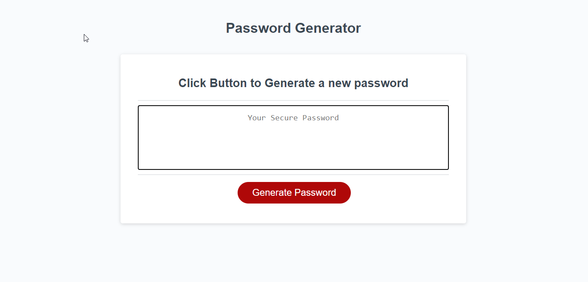

# Password Generator Starter Code
## Function
Once the user clicks the "Generate Password" button they are prompted for information.
The user must select a password length from 8 - 128 characters.
The user also must select which type of characters to allow in their password.
Once the user has finished with he prompts a new random password is displayed.

## Deployed Website
https://jshallcross.github.io/Password-Generator/
## Languages
HTML, CSS and JavaScript

## Screenshot

## Author
Jon Shallcross